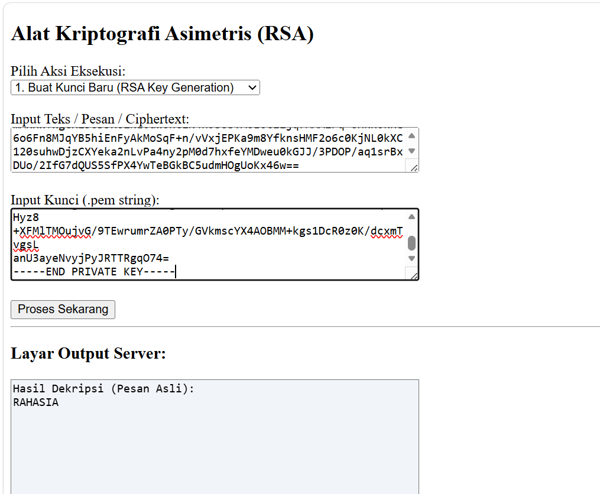

# tugas-rsa-kriptografi
Tugas Pertemua 5 Kriptografi
## Fitur
- Generate Public & Private Key
- Enkripsi pesan
- Dekripsi pesan

## Cara Penggunaan
1. Generate key
2. Enkripsi pesan "RAHASIA" menggunakan public key
3. Dekripsi menggunakan private key

## Hasil Uji
Pesan berhasil dienkripsi dan dikembalikan ke bentuk semula.

## Preview

## Author
Nama: (NADA NURRAMADHANI ROSMITA)
NIM: (252220058)
